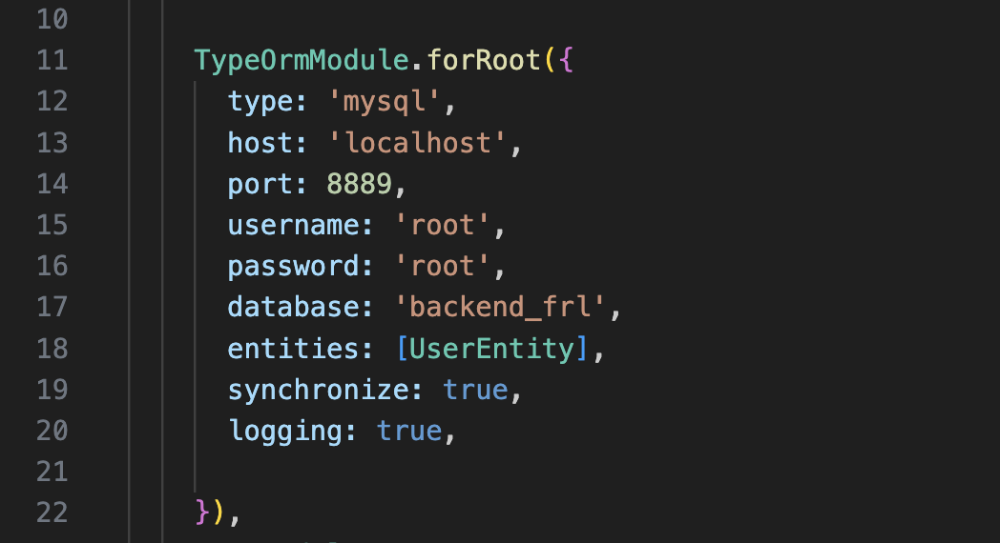
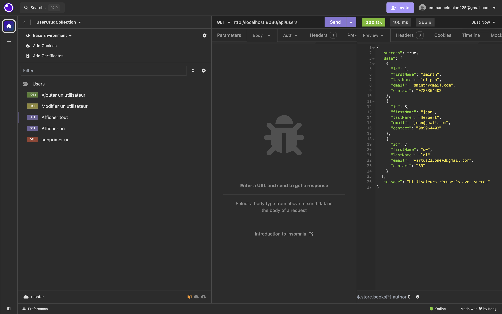

### BACKEND

Cette **API** developpée avec le Langage **Nodejs** et le framework NestJS.

### Fonctionnalités

- [x] **CRUD** des utilisateurs

### Installation en local

#### Cloner le projet git

Avant tout , télécharger le projet dans un répertoire

#### Configuration

Vous pouvez modifier les paramètres de connexion à la base de donnée dans le fichier :

src/app.module.ts



#### lancer npm install

```sh
  npm install
```


### Aperçu de l'API

Vous pouvez importer le fichier **insomnia_crud.json** dans insomnia ou postman pour tester l'API



### Contributeurs

- Emmanuel Malan 
